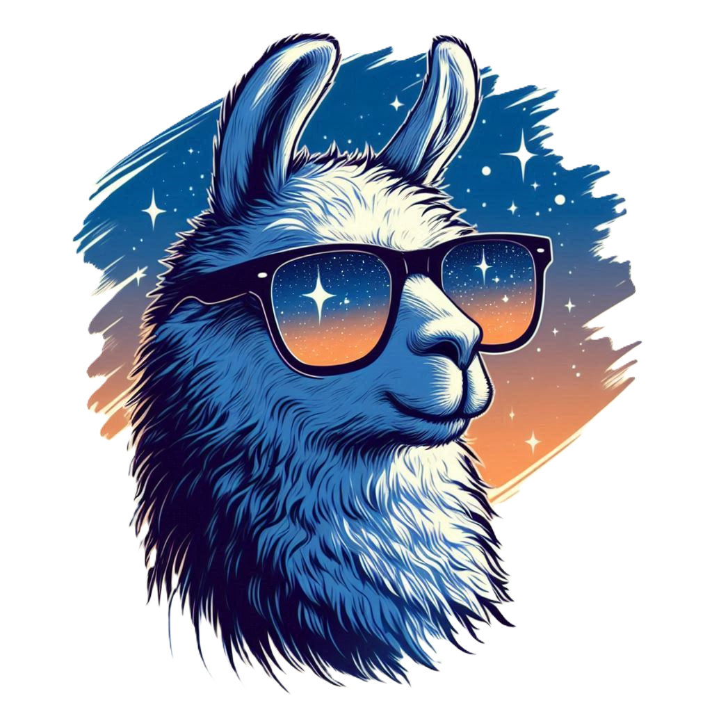

# <i>SpecDecodes:</i> A Library for Speculative Decoding

<br>

## 1. Fast Run & Test:

a. Naive LLM Decoding:
```bash
LOGLEVEL=DEBUG CUDA_VISIBLE_DEVICES=0 python run_test.py --max-new-tokens 256 --temp 1.0 --do-sample -nw --mode naive --seed 999 -llm meta-llama/Llama-2-7b-chat-hf
```

b. Classic Speculative Decoding:
```bash
LOGLEVEL=DEBUG CUDA_VISIBLE_DEVICES=0 python run_test.py --max-new-tokens 256 --temp 1.0 --do-sample -nw --mode sd-classic --sd-method greedy --seed 999 -llm meta-llama/Llama-2-7b-chat-hf -ssm TinyLlama/TinyLlama_v1.1 
```

c. Eagle-based Speculative Decoding:
```bash
LOGLEVEL=DEBUG CUDA_VISIBLE_DEVICES=0 python run_test.py --max-new-tokens 256 --temp 1.0 --do-sample -nw --seed 999 --mode sd-eagle --sd-method greedy -llm meta-llama/Llama-2-7b-chat-hf -ssm <SSM directory>
```

## 2. Run MT-Bench Benchmark:

a. Naive LLM Decoding:
```bash
LOGLEVEL=INFO CUDA_VISIBLE_DEVICES=1 python -m specdecodes.benchmark.run_mtbench --dtype float16 -llm meta-llama/Llama-2-7b-chat-hf --mode naive --do-sample --temp 1.0 --log-dir <log directory>
```

b. Classic Speculative Decoding:
```bash
LOGLEVEL=INFO CUDA_VISIBLE_DEVICES=1 python -m specdecodes.benchmark.run_mtbench --dtype float16 -llm meta-llama/Llama-2-7b-chat-hf -ssm <draft model directory> --mode sd-classic --sd-method greedy --do-sample --temp 1.0 --out-dir <out directory> --log-dir <log directory>
```

c. Eagle-based Speculative Decoding:
```bash
LOGLEVEL=INFO CUDA_VISIBLE_DEVICES=1 python -m specdecodes.benchmark.run_mtbench --dtype float16 -llm meta-llama/Llama-2-7b-chat-hf -ssm <draft model directory> --mode sd-eagle --sd-method greedy --do-sample --temp 1.0 --out-dir <out directory> --log-dir <log directory>
```

## ~~2. Run MT-Bench Benchmark:~~ (Old, much slower and may not work)

```bash
CUDA_VISIBLE_DEVICES=0 python -m specdecodes.benchmark.llm_judge.gen_sd_answer --model-id llama7b --dtype float16 --mode sd-classic --sd-method greedy -llm meta-llama/Llama-2-7b-chat-hf -ssm TinyLlama/TinyLlama-1.1B-Chat-v1.0 --out-dir specdecodes/experiments/mt-bench/b/greedy-d9k15/l1kl
```


## 3. To Train Eagle-Based SSM:

### 1. Generate Dataset

```bash
python -m specdecodes.train.data_gen.allocation --gpu_index 0 --outdir <dataset save location>
```

### 2. Train SSM

```bash
CUDA_VISIBLE_DEVICES=0,1,2,3 accelerate launch --main_process_port 29500 --num_processes=4 --mixed_precision=bf16 -m specdecodes.train.main_eagle --datadir <dataset location> --data-ratio 1 --savedir <save location> --wandb 
```

## TODO

- [ ] Implement efficient tree pruning
  - Current code does not prune token tree. This results in extra llm computation time.

- [ ] Rewrite data_gen
  - data_gen produces wrong masking. Currently only old version works.
  - Rewrite data_gen with cleaner code.

- [ ] Handle multiple GPU inference correctly
  - May require copying llm's embed_token in each GPU for efficiency.
  - May require refactoring wrapper and ssm's code.

- [ ] Handle profiling in a better way
  - Currently, we implement & import a seperate class for each wrapper, which is not efficient.
  - May require grouping code to several functions to unify naive and sd classes.